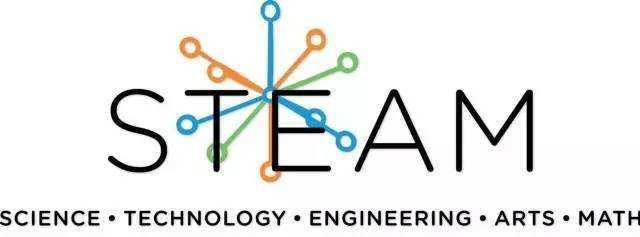

<!--

    <iframe width="300" height="220" src="https://www.youtube.com/embed/-TwocCeJUe8" frameborder="0" allowfullscreen>
    </iframe>

 -->
**来自麻省理工学院的小黄鸭无人车**  
**中文站点由[易科机器人实验室](http://blog.exbot.net " ") 维护**     
**Duckietown is a robotics educations and outreach effort.**  

鸭子小镇（Duckietown）项目源于2016年的MIT研究生课程; 截至2017年，全球约有20所大学已经使用了此课程材料以及另有数百名自学者独立研读了此课程。

该课程最主要的目标是为 **自主系统** 的学习者提供一种 **低成本** **体验式** 的教育手段。

我们的机器人平台包括一个简单的自主机器人 **鸭子车(Duckiebots)** ，以及一套在其中导航用的基础环境设施 **鸭子小镇（Duckietown）** 组成。

除了 **硬件** 和 **软件** 外，我们还建立了一套可用于各种教育水平的 **学习模块** 。

### 项目的当前状态
Duckietown已经从一个研究生课程，成长为一个国际课程。我们正在创建第二版的课程和教材，并为2018年初的大型宣传活动做准备。您可以通过多种方式提供帮助。

中文版教程及中国区相关活动，欢迎联系Top Liu博士

[`top@duckietown.cn`](mailto:top@duckietown.cn)

[`top1944@163.com`](mailto:top1944@163.com)

Duckietown是一个分布式的开源项目。主要开发工作由瑞士苏黎世联邦理工学院，加拿大蒙特利尔大学，台湾交大，美国芝加哥丰田技术学院主办。

<!--

For more information, see the <a href="http://book.duckietown.org/master/duckiebook/what_is_duckietown.html#sec:what-is-duckietown">section <em>What is Duckietown?</em></a> in the Duckietown book.
 -->

    
    
    
    
    
    

### 中国合作伙伴
2018年4月开始我们将在中国开设全球首个面向中小学生的Duckietown课程。

并将在该课程中融合Scratch编程、Python编程、开源硬件设计、3D打印等系列内容。

    
    #

### 中文论坛
[ROSWiki](http://www.roswiki.com/ " ")

### 中国ROS开发者联盟

[易科机器人实验室](http://blog.exbot.net " ")      
[黑蚂蚁机器人](http://www.blackant.org " ")   
唐尼机器人     
[星火计划](http://blog.exbot.net/spark/" ")  
ROS Summer School  
[RelayZhang](https://blog.csdn.net/zhangrelay" ")  
古月居       

### 新闻

<ul id='news'>
  
  
    <li>
    {{ post.date | date_to_long_string }}
      <a href="{{ post.url }}">{{ post.title }}</a>
      <!-- {{ post.excerpt | remove: '
' | remove: '
' }} -->
      <a href="{{ post.url }}">(read more)</a>
    </li>
  
  
</ul>

