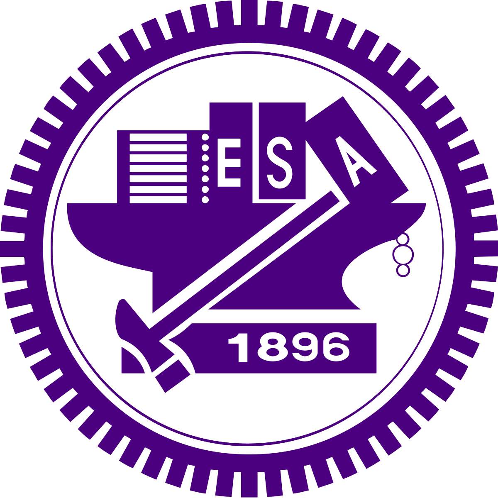
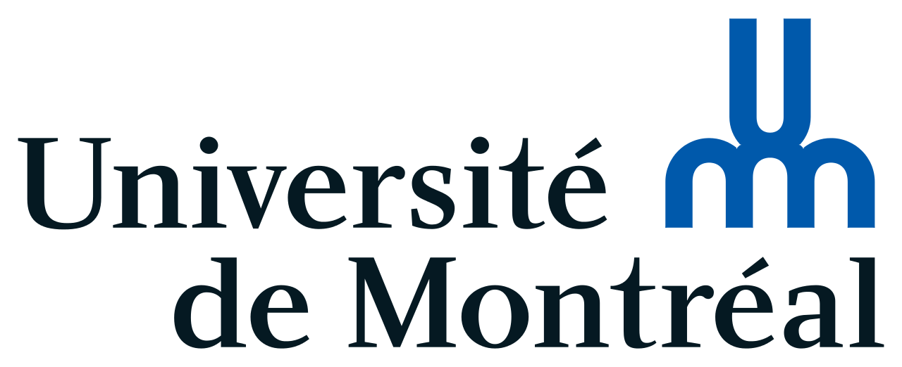
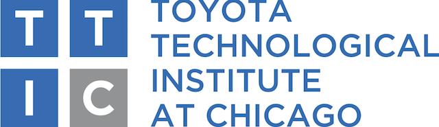

<!--

    <iframe width="300" height="220" src="https://www.youtube.com/embed/-TwocCeJUe8" frameborder="0" allowfullscreen>
        <!-- -->
    </iframe>

 -->

**Duckietown is a robotics educations and outreach effort.**

The project started as a graduate class in 2016; as of 2017, about 20 other
universities have used the materials produced, as well as hundreds of self-guided
learners.

The most tangible goal of the project is to provide a **low-cost educational
"experience"** for learning autonomy.

Our platform consists of the "Duckiebots", simple autonomous robots, and the
"Duckietowns", the infrastructure in which the Duckiebots navigates.

In addition to the **hardware** and **software**, we build a set of **learning
modules** that can be used at various levels of education.

### Current status of the project

Duckietown has graduated from being one class to an international initiative.
We are in the process of creating the second version of the class and the
materials, preparing for a large publicity initiative in early 2018. There are
many ways in which [you can help](help.html).

<!--

For more information, see the <a href="http://book.duckietown.org/master/duckiebook/what_is_duckietown.html#sec:what-is-duckietown">section <em>What is Duckietown?</em></a> in the Duckietown book.
 -->

    <!--  -->
    
    
    
    

### News

<ul id='news'>
  
  
    <li>
    {{ post.date | date_to_long_string }}
      <a href="{{ post.url }}">{{ post.title }}</a>
      <!-- {{ post.excerpt | remove: '
' | remove: '
' }} -->
      <a href="{{ post.url }}">(read more)</a>
    </li>
  
  
</ul>

