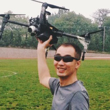

## Top Liu

    

 

控制工程专业博士，易科机器人实验室成员,从事机器人运动控制研究,并秉承“探索、创造、分享”的精神致力于先进机器人技术的传播与普及，出版机器人相关专著2本、译著6本，参与并维护多个开源项目。Exbot网站目前为广大ROS开发者维护有大量原创教程及开源图书，原创工具包，以及其他开源镜像等。

## 张瑞雷

    

控制工程专业博士，易科机器人实验室成员，机器人与人工智能技术爱好者，在高校从事多机器人系统仿真与编队协调控制研究与教学工作，已开设3门与ROS相关机器人方向本科课程，易科机器人实验室成员，热衷于机器人前沿技术的分享与交流。目前正在积极参与“星火计划”ROS公开课活动，希望能为开源机器人社区贡献更多力量。

## 吴博

    

系统工程专业博士，易科机器人实验室成员，研究方向为移动机器人同步定位与地图构建、信息融合与非线性滤波、无人平台指挥与控制，参与科研项目十余项，发表学术论文十余篇，参与出版译著两部。

## 祝朝政

    

河海大学本科，南京理工大学在读硕士研究生，易科机器人实验室成员，河海大学NDS机器人运动与视觉实验室负责人。具有5年以上的机器人相关研发经验，参与国家级课题项目4项，申请知识专利8项。研究方向：即时定位与地图构建（SLAM），机器视觉，负责实验室移动机器人视觉导航相关工作。
